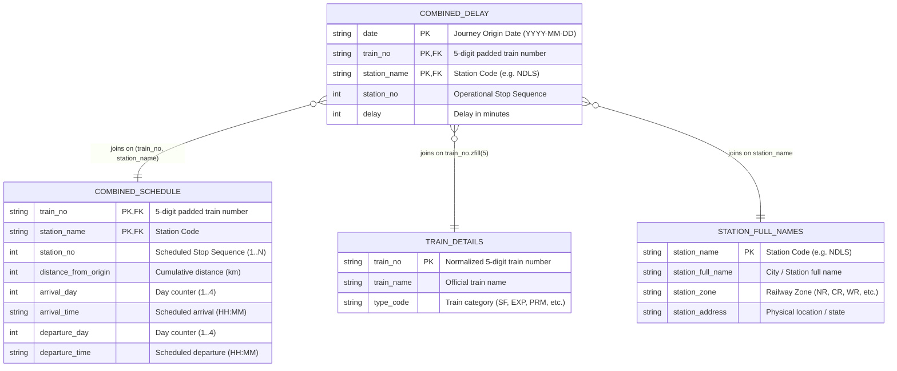

# Indian Railways Dataset Inspection & Schema Analysis Report
**Problem Statement SIH 26028: Dynamic Forecast of Expected Time of Arrival (ETA) for Coaching Trains**
*Generated on: 2026-09-29*

---

## 1. Executive Summary

A comprehensive, non-destructive audit and empirical schema inspection of all datasets located in `e:/train/data/` was conducted. The repository contains 6 CSV datasets totaling **~1.05 GB** on disk:
- **Core Dynamic Delay Data**: `combined_delay.csv` contains **38,428,703 historical train arrival observations** spanning exactly one full year (**2025-02-08 to 2026-02-07**, 365 days).
- **Core Static Schedule Data**: `combined_schedule.csv` contains **172,112 scheduled stop records** covering **8,673 unique trains** and **8,629 unique stations**.
- **Reference Metadata**:
  - `train_details.csv`: 8,992 train classification records across 8 train categories (`PASS-TRAINS`, `EXP-TRAINS`, `SF-TRAINS`, `PRM-TRAINS`, `T18-TRAINS`, `SHT-TRAINS`, `GRB-TRAINS`, `RAJ-TRAINS`).
  - `station_full_names.csv`: 8,963 unique station codes with full English names, railway zones, and addresses.
- **Historical Timetables (2015 & 2017)**: Severely outdated historical snapshots (8–11 years old) with substantial formatting noise, altered station run-times, and missing >36% of modern trains. They are **not recommended** for ML training.

---

## 2. File-by-File Catalog

| File Name | Disk Size | Rows | Columns | Inferred Data Types | Date Range | Primary Key Candidate |
|---|---|---|---|---|---|---|
| **`combined_delay.csv`** | 969.71 MB (1,016,810,952 B) | 38,428,703 | 5 | `date`: String (YYYY-MM-DD)<br>`station_no`: Int16 (1..119)<br>`station_name`: String (Station Code)<br>`delay`: Int32 / Float64 (minutes)<br>`train_no`: String (5-digit padded) | 2025-02-08 to 2026-02-07 (365 days) | `(date, train_no, station_no)` or `(date, train_no, station_name)` (0 duplicates) |
| **`combined_schedule.csv`** | 5.24 MB (5,491,587 B) | 172,112 | 8 | `station_no`: Int16 (1..119)<br>`station_name`: String (Station Code)<br>`distance_from_origin`: Int32 (0..4188 km)<br>`arrival_day`: Int8 (1..4)<br>`arrival_time`: String (HH:MM)<br>`departure_day`: Int8 (1..4)<br>`departure_time`: String (HH:MM)<br>`train_no`: String (5-digit padded) | Static Master Schedule | `(train_no, station_no)` or `(train_no, station_name)` (0 duplicates) |
| **`train_details.csv`** | 281.86 KB (288,627 B) | 8,992 | 3 | `train_no`: String (3..5 digits, e.g. 961, 1211, 12049)<br>`train_name`: String<br>`type_code`: Categorical String (8 types) | Static Metadata | `train_no` (after deduplicating 272 duplicate rows) |
| **`station_full_names.csv`** | 451.97 KB (462,816 B) | 8,963 | 4 | `station_name`: String (Station Code, e.g. NDLS)<br>`station_full_name`: String (Full Station Name)<br>`station_zone`: Categorical String (e.g. NR, CR)<br>`station_address`: String | Static Reference | `station_name` (Station Code) (0 duplicates) |
| **`2015 timetable.csv`** | 7.68 MB (8,050,200 B) | 69,006 | 12 | 12 columns with single quotes & trailing whitespace (`'Train No.'`, `'station Code'`, etc.) | August 2015 snapshot | `('Train No.', 'islno')` |
| **`2017 timetable.csv`** | 15.93 MB (16,704,995 B) | 186,124 | 12 | 12 columns (`Train No`, `SEQ`, `Station Code`, `Arrival time`, `Departure Time`, `Distance`, etc.) | November 2017 snapshot | `('Train No', 'SEQ')` |

---

## 3. Detailed Entity Representation & Semantics

### 3.1 Train Number (`train_no`)
- In `combined_delay.csv` and `combined_schedule.csv`, `train_no` is strictly formatted as a **5-digit zero-padded string** (e.g., `'00961'`, `'01211'`, `'12209'`). 100% of rows have length 5.
- In `train_details.csv`, `train_no` has variable lengths due to unpadded numeric export:
  - 5 digits: 8,385 trains
  - 4 digits: 605 trains (e.g., `'1211'`, `'1461'`)
  - 3 digits: 2 trains (`'961'`, `'962'`)
- **Resolution**: Must normalize with `.str.zfill(5)` across all tables. After zero-padding, **100% of trains in `combined_delay` match `train_details`**.

### 3.2 Station Code vs Station Name (`station_name`)
- In `combined_delay.csv`, `combined_schedule.csv`, and `station_full_names.csv`, the column named **`station_name` actually contains the Indian Railways Station Code** (e.g., `'CSMT'`, `'NDLS'`, `'HWH'`, `'AA'`).
- The actual textual station name is stored only in `station_full_names.csv` as **`station_full_name`** (e.g., `'NEW DELHI'`, `'MUMBAI CSMT'`).
- Station codes are 100% uppercase alphabetic/alphanumeric strings without leading or trailing whitespace.

### 3.3 Date Semantics (`date`)
- In `combined_delay.csv`, `date` represents the **Train Journey Origin Start Date (Train Run Date)**, NOT the local calendar arrival date at each intermediate station.
- Verification: For multi-day trains spanning 3 to 4 days (e.g. Train `01025` from Mumbai to Ballia taking 3 calendar days), all 28 intermediate stations across Day 1, Day 2, and Day 3 share the exact same `date` value.

### 3.4 Scheduled Times, Distances, and Station Sequence
- `station_no`: Represents the sequential stop index along the route. Strictly 1-indexed (starts at 1 for 100% of trains). Ranges from 1 up to 119 stops per route (median: 17 stops).
- `distance_from_origin`: Cumulative railway distance in kilometers from origin. Monotonically non-decreasing for 100% of trains (min: 0 km, max: 4,188 km).
- `arrival_day` / `departure_day`: Relative journey day counter (1 to 4).
- `arrival_time`: 24-hour clock string (`HH:MM`).
  - Exactly 8,673 nulls in `combined_schedule.csv` (strictly at `station_no == 1`, origin station where arrival time is not applicable).
  - 100% of non-null values conform strictly to regex `^([01]\d|2[0-3]):[0-5]\d$`.
- `departure_time`: 24-hour clock string (`HH:MM`).
  - Exactly 8,673 nulls in `combined_schedule.csv` (strictly at terminal stations where departure time is not applicable).
  - 100% of non-null values conform strictly to regex `^([01]\d|2[0-3]):[0-5]\d$`.

### 3.5 Delay Representation & Actual Arrival Time
- Actual timestamps are **not** logged directly as full datetime strings; rather, `delay` is stored directly in **minutes**:
  $$\text{Actual Arrival Timestamp} = \text{Journey Origin Date} + (\text{arrival\_day} - 1)\text{ days} + \text{scheduled\_arrival\_time} + \text{delay (minutes)}$$
- Delay Distribution Breakdown ($N = 38,428,703$):
  - **Null Delays**: 1,874,271 rows (4.88%). Distributed across intermediate stations (operational bypasses, station non-reporting, or telemetry gaps).
  - **Early Arrivals ($\text{delay} < 0$)**: 773,174 rows (2.01%), ranging from $-1$ to $-120$ minutes. Built-in buffer recovery before major junctions.
  - **Strictly On-Time ($\text{delay} = 0$)**: 4,898,984 rows (12.75%).
  - **Minor Delays ($0 < \text{delay} \le 15\text{ min}$)**: 12,438,101 rows (32.37%).
  - **Moderate Delays ($15 < \text{delay} \le 60\text{ min}$)**: 12,505,210 rows (32.54%).
  - **Significant Delays ($60 < \text{delay} \le 180\text{ min}$)**: 4,802,089 rows (12.50%).
  - **Severe Delays ($180 < \text{delay} \le 720\text{ min}$)**: 1,080,986 rows (2.81%).
  - **Extreme Outliers ($> 1,440\text{ min}$ / 24 hours)**: 15,073 rows (0.04%). Top outlier: 525,592 minutes (~365 days, leap year/epoch wraparound bug).

---

## 4. Join Relationships & Key Compatibility Matrix



### Critical Join Findings:
1. **Delay $\rightarrow$ Schedule Join Key**:
   - Joining on `(train_no, station_no)` results in **6,714,008 station code mismatches** (18.0%). This is because `combined_delay` includes operational logging halts (crew changes, technical stoppages) that shift intermediate sequence numbers relative to commercial passenger timetables.
   - Joining on **`(train_no, station_name)`** resolves this issue and achieves a **96.63% match rate** (37,133,436 / 38,428,703 rows).
   - Therefore, **`(train_no, station_name)` is the mandatory canonical join key**.
2. **Delay $\rightarrow$ Train Details Join**:
   - `train_details.csv` contains 272 duplicate train numbers (544 rows) having conflicting `type_code` (e.g. `EXP-TRAINS` vs `PRM-TRAINS`).
   - Deduplication strategy: Prioritize specific service types or retain first occurrence before join.
   - Join coverage: **100.00%** (all 7,033 trains in `combined_delay` exist in `train_details`).
3. **Delay $\rightarrow$ Station Metadata Join**:
   - Join coverage: **99.23%** (8,164 out of 8,227 stations in delay data).
   - Only 63 stations missing from `station_full_names.csv`, consisting of newly renamed stations (e.g. `BSBS` for Banaras, `KCVL` for Kochuveli, `BARS`).

---

## 5. Data Quality Issues & Mitigation Table

| Issue ID | Identified Data Quality Issue | Impacted File | Extent / Affected Rows | Recommended Mitigation |
|---|---|---|---|---|
| **DQ-01** | **Unpadded Train Numbers** | `train_details.csv` | 607 rows (605 4-digit, 2 3-digit) | Apply `.str.zfill(5)` to standardize as 5-digit strings. |
| **DQ-02** | **Duplicate Train Numbers with Conflicting Types** | `train_details.csv` | 272 duplicate pairs (544 rows) | Deduplicate on `train_no`, preserving hierarchy (Premium/Superfast over generic). |
| **DQ-03** | **Extreme & Impossible Delay Outliers** | `combined_delay.csv` | 15,073 rows $>1440$ min (max: 525,592 min) | Filter out impossible delays ($>1440$ min or $<-120$ min) during ML training. |
| **DQ-04** | **Null Delays at Intermediate Stops** | `combined_delay.csv` | 1,874,271 rows (4.88%) | Mark as missing observation; impute via forward-fill along active route or mask. |
| **DQ-05** | **Sequence Number Desynchronization** | `combined_delay.csv` vs `combined_schedule.csv` | 6.7M rows if joined by `station_no` | **Do not join on `station_no`**. Join strictly on `(train_no, station_name)`. |
| **DQ-06** | **Missing Station Codes in Master** | `station_full_names.csv` | 63 modern station codes | Impute zone as `'UNKNOWN'` or use railway prefix rules (e.g. `BSBS` $\rightarrow$ `NER`). |
| **DQ-07** | **Single Quote & Whitespace Padding** | `2015 timetable.csv` | 100% of rows | Strip quotes and trailing whitespace if ever used as supplementary reference. |

---

## 6. Evaluation of 2015 & 2017 Timetable Datasets

1. **2015 Timetable (`2015 timetable.csv`)**:
   - Contains 69,006 rows and only 2,810 trains.
   - Covers only **24.96%** of trains in the active 2025/2026 dataset.
   - Significant data formatting artifacts (all numbers and times enclosed in single quotes, space-padded columns).
   - **Verdict**: Completely obsolete. **Exclude from pipeline**.

2. **2017 Timetable (`2017 timetable.csv`)**:
   - Contains 186,124 rows and 11,113 trains.
   - Covers **63.84%** of 2025 trains, but **3,136 trains are completely absent**.
   - Verified that scheduled timings for overlapping trains have shifted by 10–30 minutes due to 8 years of track upgrades, electrification, and revised sectional run times.
   - **Verdict**: Incompatible with 2025–2026 ground truth delay logs. **Exclude from ML training**.

---

## 7. Recommended Datasets for ML Model

| Dataset | Role in Machine Learning Pipeline | Status |
|---|---|---|
| `data/combined_delay.csv` | **Primary Target & Feature Source**: Historical sequence delays, progression patterns, time-series lags | **MANDATORY** |
| `data/combined_schedule.csv` | **Primary Static Topology & Schedule Source**: Scheduled arrival/departure times, distance, planned run-times | **MANDATORY** |
| `data/train_details.csv` | **Categorical Metadata Feature**: Train priority classification (`type_code`), train names | **MANDATORY** |
| `data/station_full_names.csv` | **Spatial / Network Metadata**: Railway zone (`station_zone`), geographical grouping | **RECOMMENDED** |
| `data/2015 timetable.csv` | Historical Timetable | **EXCLUDED** |
| `data/2017 timetable.csv` | Historical Timetable | **EXCLUDED** |

---

## 8. Proposed Data-Processing Pipeline Architecture

```
[Raw CSVs]
   ├── combined_delay.csv (38.4M rows)
   ├── combined_schedule.csv (172k rows)
   ├── train_details.csv (8.9k rows)
   └── station_full_names.csv (8.9k rows)
           │
           ▼
[Stage 1: Standardization & Sanitization]
   ├── Normalize train_no -> .str.zfill(5)
   ├── Deduplicate train_details.csv on train_no
   ├── Filter impossible delay outliers (-120 <= delay <= 720 or 1440 min)
   └── Clean station_name -> uppercase stripped code
           │
           ▼
[Stage 2: Canonical Multi-Table Join]
   ├── combined_delay JOIN combined_schedule ON [train_no, station_name]
   ├── LEFT JOIN train_details ON [train_no]
   └── LEFT JOIN station_full_names ON [station_name]
           │
           ▼
[Stage 3: Feature Engineering for Dynamic ETA Forecast]
   ├── Journey Progress Features:
   │     • distance_traveled, remaining_distance, fraction_journey_completed
   │     • scheduled_travel_time_between_stops, planned_speed
   ├── Dynamic Progression Features (Current State of Train):
   │     • current_station_delay (latest known delay)
   │     • delay_delta (change in delay over last 1, 2, 3 stations)
   │     • route_cumulative_delay_trend (delay gradient)
   ├── Temporal Features:
   │     • scheduled_hour, day_of_week, month, is_weekend, departure_day
   │     • time_of_day (morning / peak / evening / night)
   └── Network & Priority Features:
         • train_type (Superfast, Premium, Express, Passenger)
         • station_zone, station_degree / junction indicator
           │
           ▼
[Stage 4: Modeling Split & Evaluation Setup]
   ├── Strict Chronological Time-Based Split (e.g. First 10 months train, next 2 months test)
   │   (Never random split to prevent future-data leakage in dynamic forecasting)
   └── Target: Residual Delay at Target Station (Predicted ETA = Scheduled Arrival + Predicted Delay)
```

